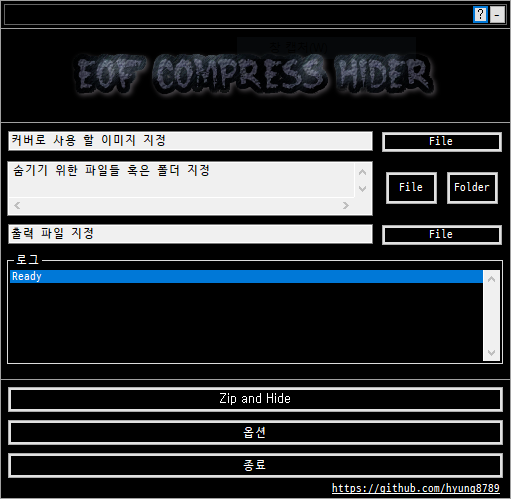

# EOF Compress Hider

A simple implementation of Steganography using EOF (End-of-file) method

  

## < Introduction >

## < Features >

## < Screenshot >
  

## < How to use >

## < Download >

## < License >
<b>[This application is licensed under the MIT License.](https://github.com/hyung8789/EOF_Compress_Hider/blob/master/LICENSE)</b>  
Font used in this application is D2 Coding. 
Copyright (c) 2015, NAVER Corporation (http://www.navercorp.com) 
SIL Open Font License, Version 1.1 : https://github.com/naver/d2codingfont/wiki/Open-Font-License  
