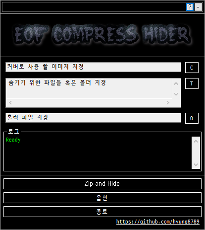
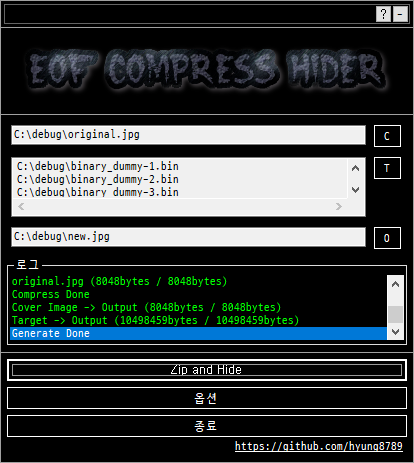

# EOF Compress Hider
  
A simple implementation of Steganography using EOF (End-of-file) method

 

## < For What & How it works >
Steganography is a cryptographic technique for hiding files, messages, images, or videos from other files, messages, images, or videos that you want to convey.
There are a various technique that hiding secret data, this application is a simple implementation of Steganography using EOF (End-of-file) method.

The data for concealment is compressed and inserted after the EOF(End-of-file) tag in the image file.
All text or binary data behind the EOF tag in the image file is ignored when the image is viewed through a web browser (If the image file is uploaded to the Internet) or when the image is viewed directly using a photo editing application.
Thus, although it appears to be a superficially normal image file, hidden data can be accessed because the commercial decompression utility recognizes the compression header upon opening after changing the extension to '.zip'.

 

## < Features >
<b>- Cover Image : Image that appears to be a surface to disguise itself as a normal image file.</b> 
<b>- Target : The data for concealment.</b> 
<b>- Output File : File combined with Cover Image + Target.</b> 

- Supported Type for Cover Image And Output File : JPEG (*.jpg,*.jpeg,*.jpe,*.jfif), PNG (*.png), BMP (*.bmp,*.dib), GIF (*.gif)
- Supported Type for Target : All file types (.*) or Folder
- Supported compress Target with password encryption

 

## < Demo & Screenshot >
  
  
  
Above 'Brick Image' has hidden data (Compressed with Password : 1234).
You can open it with decompression utility after changing the extension to '.zip'.

 

## < System Requirement >
- .Net Framework 4.8

 

## < License >
[This application is licensed under the MIT License.](https://github.com/hyung8789/EOF_Compress_Hider/blob/master/LICENSE)</b>  
This application used 'D2 Coding' font. 
Copyright (c) 2015, NAVER Corporation (http://www.navercorp.com) 
SIL Open Font License, Version 1.1 : https://github.com/naver/d2codingfont/wiki/Open-Font-License  
